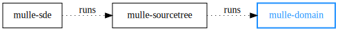

# 🏰 URL management and tag resolution for repositories

... for Android, BSDs, Linux, macOS, SunOS, Windows (MinGW, WSL)

Parses archive and repository URLs like
`https://github.com/mulle-sde/mulle-sde-developer.git` to determine the project
name (`mulle-sde-developer` in this case). Also can compose URLs based on the
hoster domain and the project name.


| Release Version                                       | Release Notes
|-------------------------------------------------------|--------------
|   | [RELEASENOTES](RELEASENOTES.md) |


## Commands

### commit-for-tag

Get the commit identifier (usually the sha hash) of a repository for the
given tag:

``` sh
mulle-domain commit-for-tag https://github.com/mulle-c/mulle-c11 latest
```


### compose-url

Create an URL to download the version 1.0.0 archive from gitlab of the
project bar of user foo:

``` sh
mulle-domain compose-url --tag 1.0.0 --user foo --repo bar gitlab
```


### list

List known domains:

``` sh
mulle-domain list
```


### nameguess

Given an URL guess the proper name of the project:


``` sh
mulle-domain nameguess https://github.com/mulle-c/mulle-c11.git
```

In this case it would be `mulle-c11`. Can fail miserably for unknown domains.

### parse-url

Breaks an URL apart into the constituent parts of interest for a mulle-sde
dependency:

``` sh
mulle-domain parse-url https://github.com/mulle-c/mulle-c11.git
```

### tag-aliases

Find tags that reference the same commit:


``` sh
mulle-domain tag-aliases https://github.com/mulle-c/mulle-c11.git latest
```

By default, it will only list semantic version (semver) compatible tags.

### tags

List available tags:

``` sh
mulle-domain tags https://github.com/mulle-c/mulle-c11.git
```

By default, it will only list semantic version (semver) compatible tags.


### tags-for-commit

List all tags for a given the commit identifier:

``` sh
mulle-domain tags-for-commit https://github.com/mulle-c/mulle-c11.git e8dfhf
```
By default, it will only list semantic version (semver) compatible tags. The
commit identifier can not be shortened.


### tags-with-commits

Lists all tags with the corresponding hashes:

``` sh
mulle-domain tags-with-commits https://github.com/mulle-c/mulle-c11.git e8dfhf
```


### typeguess


Given an URL guess the source code management (scm) employed:

``` sh
mulle-domain typeguess https://github.com/mulle-c/mulle-c11.git
```
Usually the result will be `git` or `tar`. But it can also be `zip` or `svn`.


## You are here


## Install

See [mulle-sde-developer](//github.com/mulle-sde/mulle-sde-developer) how to
install mulle-sde, which will also install mulle-domain with required
dependencies.

The command to install only the latest mulle-domain into
`/usr/local` (with **sudo**) is:

``` bash
curl -L 'https://github.com/mulle-sde/mulle-domain/archive/latest.tar.gz' \
 | tar xfz - && cd 'mulle-domain-latest' && sudo ./bin/installer /usr/local
```


## Author

[Nat!](https://mulle-kybernetik.com/weblog) for Mulle kybernetiK


